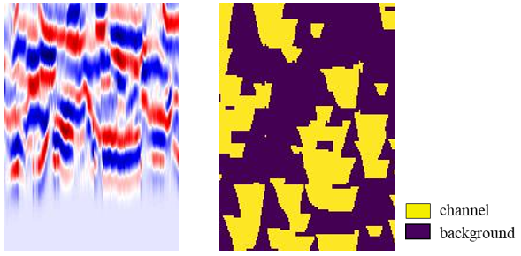
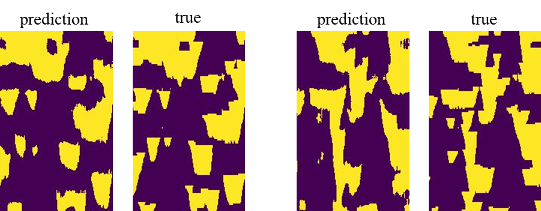
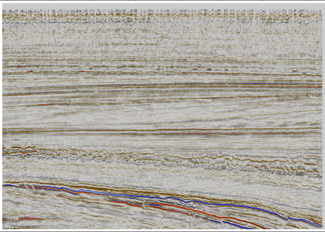
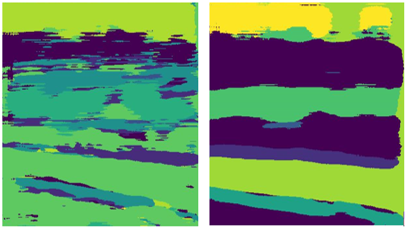

### The application of CNN with dilated kernel layers for seismic images segmentation task.

The architecture in from https://doi.org/10.1190/segam2020-3426944.1.

The architecture is a fully convolutional network constructed from 2D convolutional layers. Its first part is ordinary convolutional layers, the second part is convolutional layers with a dilation factor. Input examples are 2D images.

#### The entire process is run from the main.py file, and all the main settings are defined there. The detailed description of parameters is given in the comments in the file itself.

To run a model with a particular set of parameters set **n_param_samples** to **1** and make all hyperparameters to be lists containing a single value (**n_conv_layers_prior** = **[3]**).

Training outputs are the following: txt files with train and prediction runtimes, hyperparameter values and corresponding accuracies; folders for each model created with a particular hyperparameter set containing images of probability maps for all models and all classes, image of a predicted section, trained model, txt files with loss and accuracy history values, corresponding plots and a folder with ROC curve plots.

**main.py** – both training and prediction processes are run from this file, all the major settings are defined there  
**train.py** – contains a function that runs a training loop and saves results as well as the model implementation  
**utils.py** – contains all the miscellaneous functions to read segy and interpretation files, save results 
**predict.py** – contains a function that runs prediction and saves results

The architecture was first tested on synthetic data, 5000 training examples were available. A synthetic training example with a corresponding labeled section are shown below:

Here are examples of predicted sections compared to true labels. The true distribution is definitely captured in predicted sections, though not perfectly.

However, when it came to testing the network on real data (public F3 dataset), the predictions varied significantly, even when obtained with the same hyperparameter sets.
Below is the test section:

And in the picture below there are predictions obtained with the same hyperparameters, but different weight initializations. The corresponding accuracies are 0.43 and 0.80. We can see that the variance in the results is prohibitively high.

